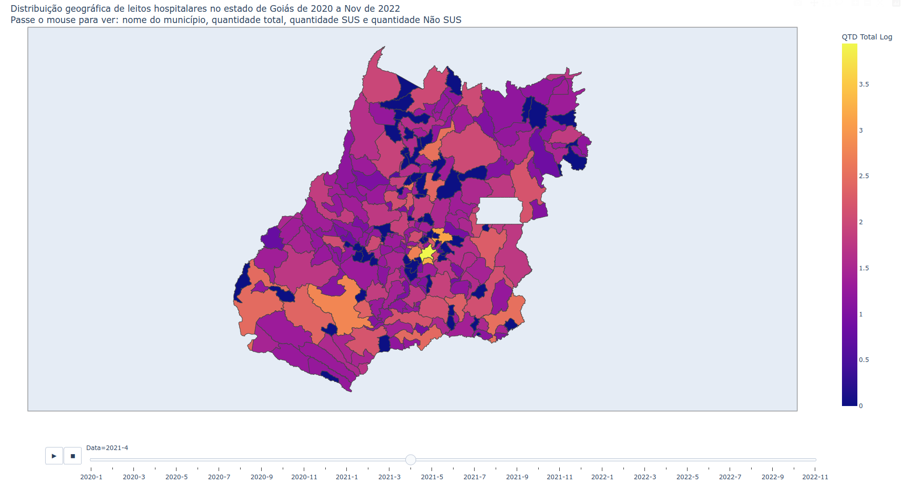

# Evolução dos leitos hospitalares em Goiás

Análise da evolução do número de leitos hospitalares no estado de GO feita em um caderno ipynb.

### Instalação das dependências
- Crie um novo ambiente:
<code>python3 -m venv /path/to/new/virtual/environment</code>

- Ative o ambiente: 
<code>$ source \<venv>\/bin/activate</code>

- Instale as dependências:
<code>pip install -r /path/to/requirements.txt</code>

### Visualização no tempo do número de leitos por município entre os anos de 2020 a 2022

